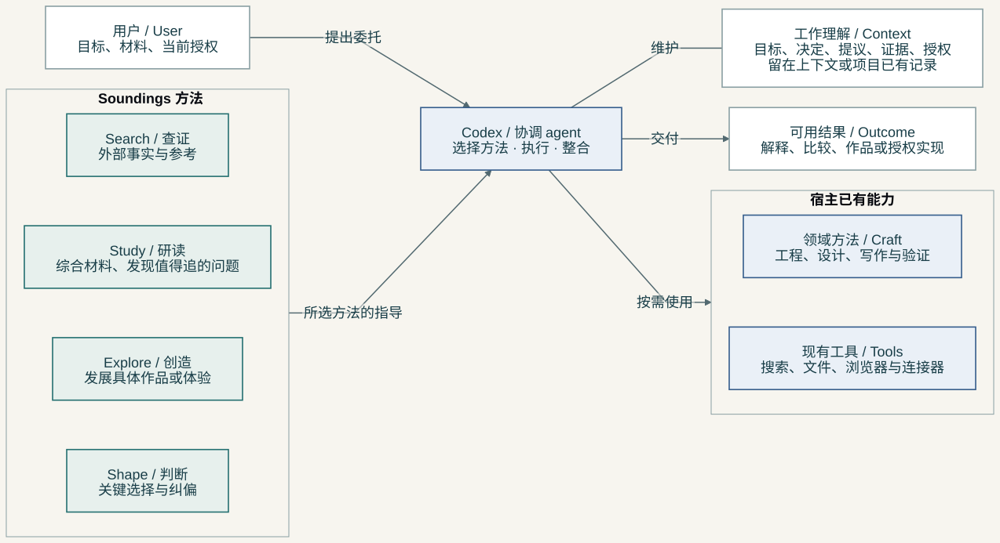

**简体中文** · [English](README.md)

# Soundings

**给 Codex 的研究与创作方法集。** 它可以查证外部事实、综合多份材料、发展创意，或处理会影响结果的选择与纠偏。面对一个已有项目，它也可以从当前工作里发现你尚未明确提出、但值得追下去的问题。

结果应当回到工作里发挥作用：一个解释、一份有依据的比较、一个具体候选、一轮纠偏，或请求已经授权的实现。普通小任务不需要因此变成研究计划。

> **早期 Demo · 运行版本 0.3.1。** 方法和产品方向仍在演变。这次文档与视觉试作不改运行行为，也不产生新 release。已有有限的有效案例；跨项目稳定的隐式选择，以及相对同一宿主不使用 Soundings 的增益，尚未得到证明。[查看证据与边界](docs/dogfood-0.3.1.md)。

## 开始使用

从公开 Git marketplace 安装：

```sh
codex plugin marketplace add IndelibleVivi/soundings
codex plugin add soundings@soundings
```

安装后开始一个 **新的 Codex task**。磁盘上的包更新了，不代表正在运行的任务已经加载了新说明。

可以正常提问，也可以明确指定其中一个 Skill：

| 现在需要什么 | 入口 | 可以怎样问 |
| --- | --- | --- |
| 外部事实或参考 | `$search` | 查一下这个服务是否支持我们的文件大小和格式，保留会影响选择的限制。 |
| 理解多份材料之间的关系 | `$study` | 这些报告互相矛盾。解释哪些分歧是真的，以及证据对当前项目意味着什么。 |
| 更充分的创作候选 | `$explore` | 把这个活动发展成完整可玩的版本，给出实际材料和一轮完整游玩示例。 |
| 关键选择或纠偏 | `$shape` | 原型采用了错误的理解。把关键差异做得可判断，并完成已授权的修正。 |

它们是 **四种独立方法，不是四道必经工序**。可以只用一个、按需组合，也可以让清楚的小改动直接完成。专业领域的证据标准和实现责任仍由相应方法承担。

对于已有项目，可以这样开始：

```text
读一下项目的目标与现有工作。找一个值得继续追的未解问题，说明它
为什么重要，并在当前请求范围内做出有用的结果。不要停在仓库总结
或功能待办上。
```

这是项目探索的目标行为，不代表自动触发已稳定。在当前 Relata 记录中，两次普通请求由更具体的仓库方法完成，没有选中 Study；随后显式 `$study` 才得到安装态方法参与的有效结果。[具体观察](docs/dogfood-0.3.1.md)。

## 它怎样参与工作



Codex 选择并读取需要的方法说明，调用已有工具，并对整合后的结果负责。Soundings 不会启动四个 agent，也没有自己的调度器。目标、已作决定、临时提议、证据和当前授权，留在对话上下文或项目已有记录里。

[架构说明](docs/architecture.zh-CN.md) 包含职责图、本地证据流、安装路径、源码对应位置，以及可编辑 Mermaid。图画的是当前 Demo，不是尚未实现的托管平台。

## 需要时，再保留可回读的证据

日常使用不要求新增存储。任务需要留存证据时，可以使用两个可选的 **本地 Python 3.10+** 工具：

`evidence.py` 保存你明确选定的 UTF-8 文本，再按精确行段回读或字面查找。旧引用继续指向当时的内容。响应会说明省略了哪些窗口，预算计算完整 JSON stdout 的字节数，不是模型 token。某段返回完整，不等于来源完整，也不等于研究已经完成。

`packet.py` 把明确选定的 brief 和快照复制到一个新目录。接手者可以检查并重读副本，不再依赖原来的 store。它不会发送这个目录、执行研究 worker，或认证来源真实性。

[保存、回读与查找](plugins/soundings/skills/search/references/evidence-reading.md) · [跨目录或 harness 交接](plugins/soundings/skills/search/references/research-handoffs.md)。只有这两个可选工具需要 Python，Skills 本身不需要。

## 更新已有安装

```sh
codex plugin marketplace upgrade soundings
codex plugin add soundings@soundings
codex plugin list --json
```

核对已安装版本与启用状态，再开新任务。市场副本刷新、插件安装、Skill 被发现和实际使用成功，分别是不同的事实。这组命令在 [0.3.1 记录](docs/dogfood-0.3.1.md) 中实际执行过；宿主行为可能继续变化。

## 当前有什么，还没有什么

包内包含四个 Skills、按需阅读的参考材料，以及两个可选工具。它没有自带开放网络搜索后端、Cloudflare corpus、MCP server、模型订阅、自动记忆或 worker runtime。Search 可以使用宿主已有工具；更强的接入仍有发展空间，但尚未成为这个 Demo 的已部署功能。

方法说明不扩大授权。研究请求不自动允许安装服务、付费、发布或上传材料。保存本地快照是明确的留存动作；私人 store 和 packet 应放在公开仓库之外。来源正文是参考材料，不是等待执行的指令。

## 继续阅读

[架构与源码对应](docs/architecture.zh-CN.md) · [完整使用案例](docs/examples/inquiry-in-practice.md) · [证据丢失调查](docs/examples/diagnosing-evidence-loss.md) · [设计依据](plugins/soundings/docs/design.md) · [行为场景](plugins/soundings/docs/behavior-scenarios.md) · [视觉系统](docs/visuals/README.md)

当前证据见 [0.3.1](docs/dogfood-0.3.1.md)。此前的 [0.3.0](docs/dogfood-0.3.0.md)、[0.2.0](docs/dogfood-0.2.0.md) 和 [0.1.0](docs/dogfood-0.1.0.md) 保留各自范围与更正，不冒充当前版本的新验证。

## 开发检查

```sh
skill-validate plugins/soundings/skills/search
skill-validate plugins/soundings/skills/study
skill-validate plugins/soundings/skills/explore
skill-validate plugins/soundings/skills/shape
python3 -m json.tool plugins/soundings/.codex-plugin/plugin.json >/dev/null
python3 -m unittest discover -s plugins/soundings/skills/search/scripts -p 'test_*.py' -v
```

`skill-validate` 由开发者另行安装。JSON 解析只证明语法，不证明宿主兼容。测试检查本地工具；实际行为仍需在新任务里跑对应场景。[仓库约定](AGENTS.md)。

## 许可

功能性插件文件、Skills、scripts 和 runtime references 使用 [SUL-1.0](LICENSE)。README、文档和独立架构图使用 [CC BY-NC-SA 4.0](LICENSE-DOCUMENTATION.md)。具体边界沿用[按路径划分的许可表](LICENSING.md)；第三方材料保留原条款，两种许可都不授予商标权。
