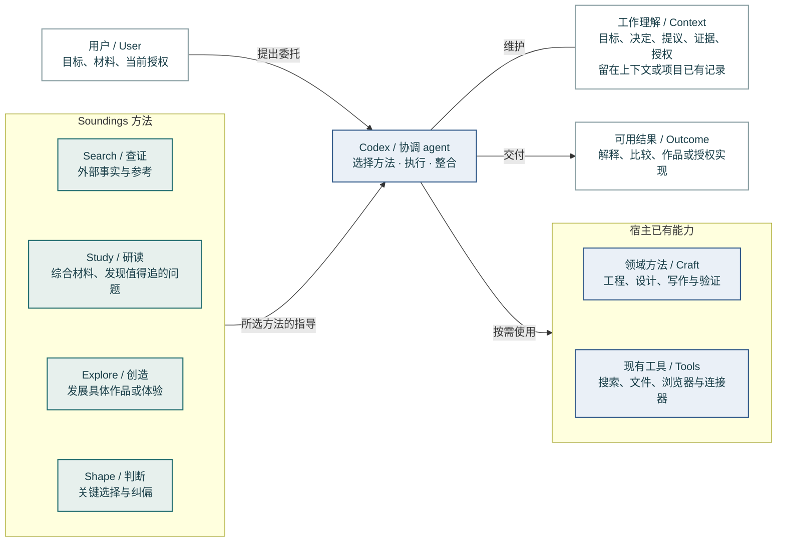
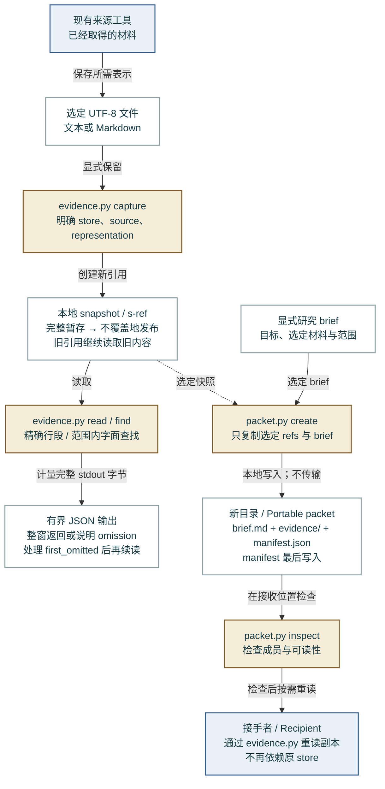
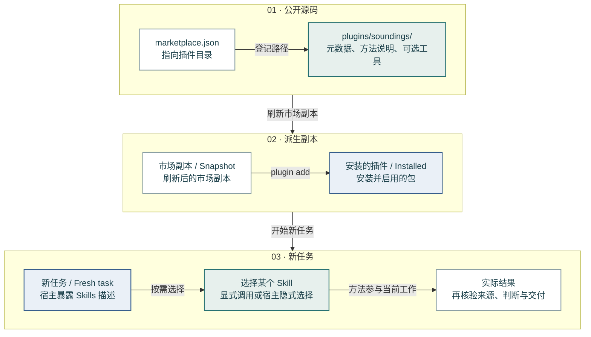

# Soundings architecture

[简体中文](architecture.zh-CN.md) · [Back to README](../README.md)

**Reading view of the 0.3.1 demo.** These diagrams describe current responsibilities and local data paths. They do not add a service, force a skill sequence or freeze the project's future architecture. Runtime contracts remain in `plugins/soundings/skills/`; the [design rationale](../plugins/soundings/docs/design.md) explains the choices.

There are three views, because method selection, evidence files and installation are different things. Teal identifies Soundings methods; blue identifies the host and its existing capabilities; ochre identifies optional local helpers. Labels carry the meaning without colour. Solid arrows describe the operation written on them. Dashed arrows mark an optional selection; they do not claim that a future adapter exists.

## 1. Who does the work?

Soundings is an instruction package consumed by the host, not a set of four running services. Search investigates outside material; Study develops understanding and can discover a project question; Explore develops concrete possibilities; Shape handles consequential choices and corrections. None requires the other three.

The coordinating agent retains the task, chooses methods, invokes tools within existing authority and delivers the result. Engineering, design and other domain methods keep their own production and evidence standards. The working context is the current understanding, normally in conversation or an existing project record; it is not a Soundings database.

**Source anchors:** [four skill directories](../plugins/soundings/skills/), [shared working context](../plugins/soundings/references/working-context.md), [project-grounded sounding](../plugins/soundings/skills/study/references/project-grounded-sounding.md).

## 2. How can evidence be retained and handed over?

Acquisition stays with existing tools. Capture takes a selected text file and a caller-declared representation: `verbatim`, `extracted` or `generated`. A fresh ref is created each time. Complete JSON is staged before a no-clobber hard link exposes the final snapshot; hard-link support is required, and this is not a power-loss durability guarantee.

Read and find use that snapshot. A window is returned whole or visibly omitted. After handling `first_omitted`, the caller can continue inside the original scope; a null next line means no remainder after that omitted window, not that the window was already read. A byte cap covers stdout, not the host's wrapper or model tokens.

Packet creation copies an explicit brief and selected refs into a new directory. The manifest is written last; a missing or invalid manifest is not a usable packet. Inspection checks membership and readability, not provenance, secrecy or research quality. The receiver reads the copied evidence with the same helper. Transfer and worker execution remain separate, independently authorised actions.

**Source anchors:** [`capture`, `publish`, `read`, `find`, `pack`](../plugins/soundings/skills/search/scripts/evidence.py), [`create`, `inspect`](../plugins/soundings/skills/search/scripts/packet.py), [reading contract](../plugins/soundings/skills/search/references/evidence-reading.md), [handoff contract](../plugins/soundings/skills/search/references/research-handoffs.md).

## 3. What does installation establish?

The marketplace manifest points to the canonical plugin package. Refresh updates a derived market copy; installation produces another derived package on the operator's machine. A new task is needed to observe discovery and selection. Do not edit an installed cache as if it were source.

Installation success is not useful method use. A task can discover a skill but prefer a domain method; loading a skill does not prove that it improved the result. The current [evidence record](dogfood-0.3.1.md) separates these observations, including negative implicit Study selection in Relata. The drawing is a deployment/observation map, not an automatic release pipeline.

**Source anchors:** [marketplace manifest](../.agents/plugins/marketplace.json), [plugin manifest](../plugins/soundings/.codex-plugin/plugin.json), [repository contract](../AGENTS.md), [installation observations](dogfood-0.3.1.md).

## Extension space, without pretending it is built

An external corpus, sustained research executor or richer media reader can be useful. Today these are distinct needs served through available tools, not implemented Soundings adapters. The existing [source-capability reference](../plugins/soundings/skills/search/references/source-capabilities.md) describes what to preserve: source identity, representation, conditions, actual read coverage and operation-specific limits. A future integration should be drawn here only when its real contract and implementation exist.

## A small vocabulary

A *commission* is the complete result the user asked for, rather than one tool call. A *candidate* is material developed enough to judge. *Working context* is the current shared understanding. A *snapshot* is a retained local representation, not certified original truth. *Implicit selection* means the host chooses a skill without an explicit `$skill` invocation. A *reopening condition* is an observation that would make a previous judgment worth revisiting.

## Editable sources

The SVGs are rendered from the following Mermaid sources, using [the visual configuration](visuals/mermaid-config.json). The code blocks below are the same sources, not a separate architecture. [Rendering and visual rules](visuals/README.md).

### 01-responsibilities

[Mermaid source](visuals/01-responsibilities.mmd) · [SVG](visuals/01-responsibilities.svg)

### 02-evidence

[Mermaid source](visuals/02-evidence.mmd) · [SVG](visuals/02-evidence.svg)

### 03-installation

[Mermaid source](visuals/03-installation.mmd) · [SVG](visuals/03-installation.svg)

