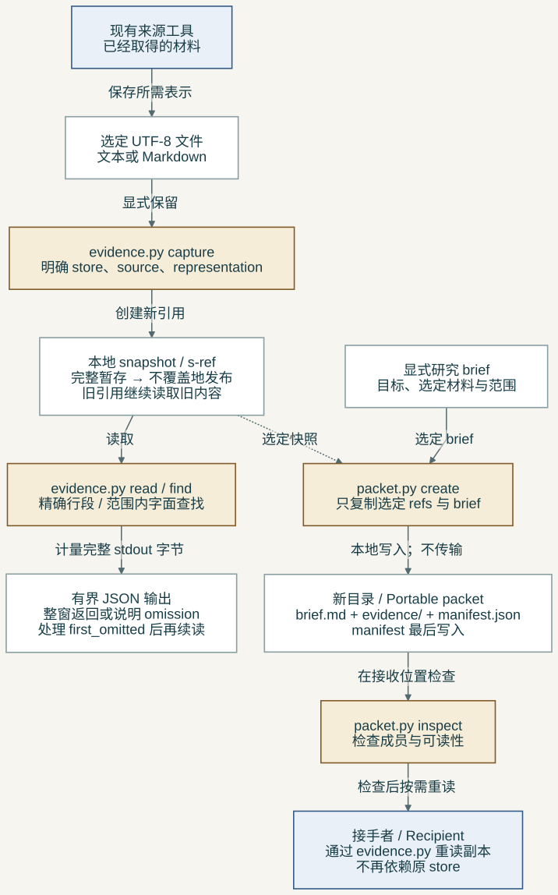
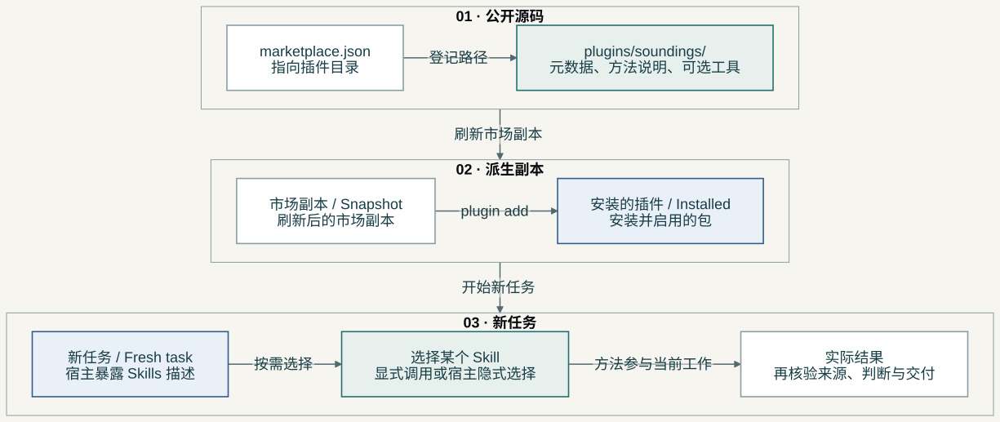
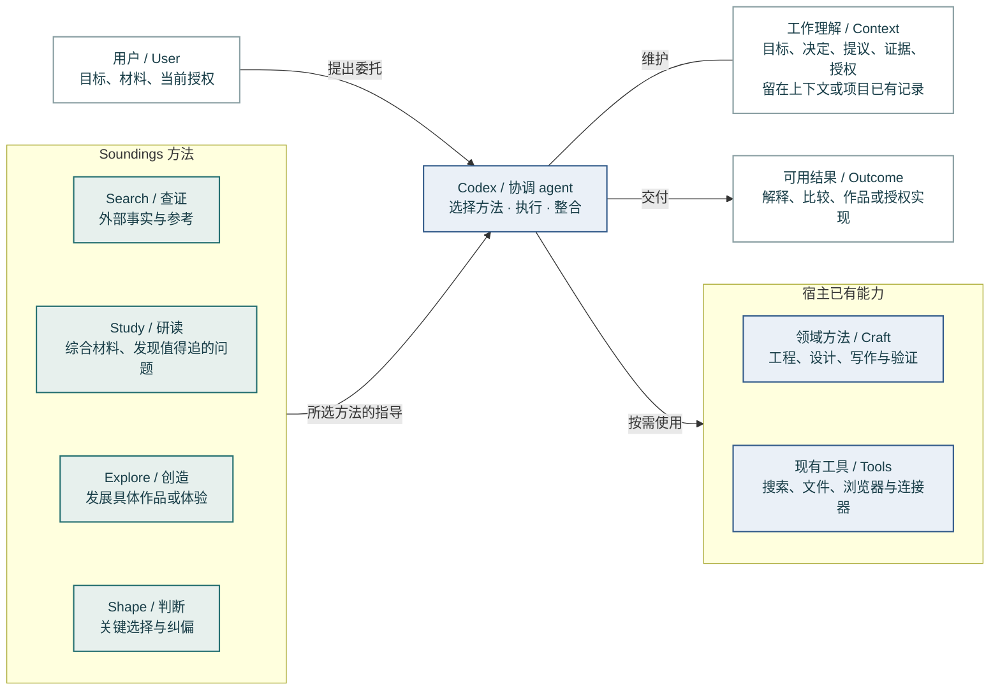
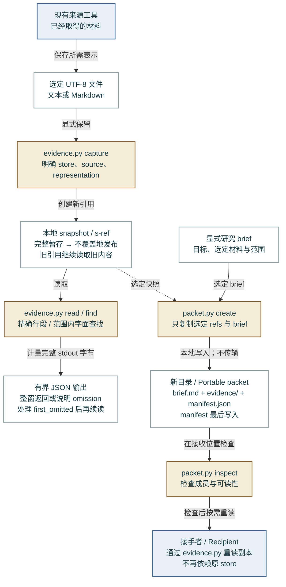
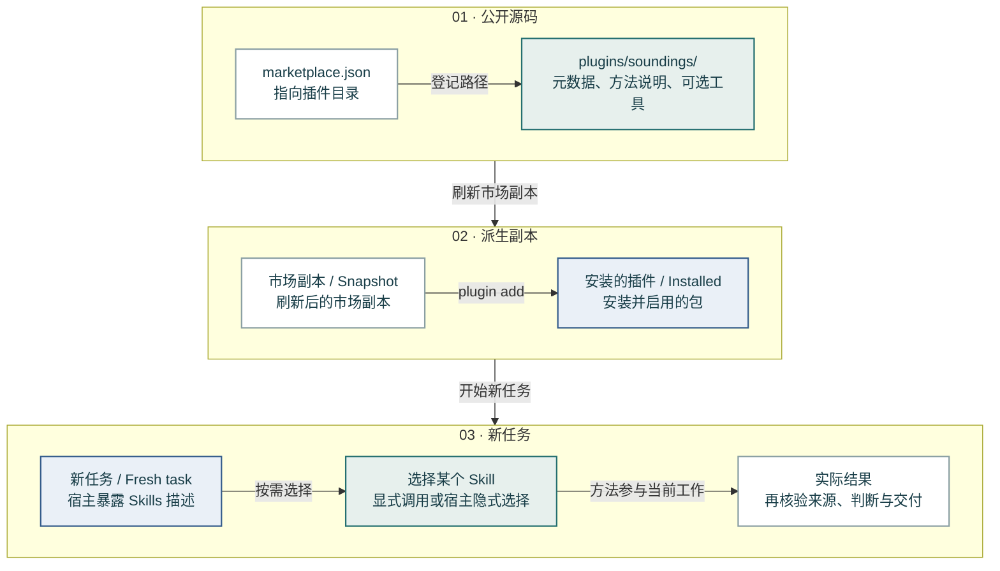

# Soundings 架构说明

[English](architecture.md) · [返回 README](../README.zh-CN.md)

**0.3.1 Demo 的阅读视图。** 这些图说明当前职责与本地数据路径，不新增服务、不规定 Skill 顺序，也不固定未来架构。运行合同仍在 `plugins/soundings/skills/`，取舍依据见[设计文档](../plugins/soundings/docs/design.md)。

方法选择、证据文件和安装是三件不同的事，因此分成三张图。蓝绿表示 Soundings 方法，蓝色表示宿主及已有能力，赭色表示可选本地工具；文字标签承担实际含义，不要求靠颜色辨认。实线箭头表示标签所写的操作；虚线表示可选材料选择，不代表某个未来 adapter 已实现。

## 1. 谁负责完成工作？

Soundings 是宿主读取的一组方法说明，不是四个正在运行的服务。Search 查外部材料；Study 形成理解，也可从项目里发现问题；Explore 发展具体可能性；Shape 处理关键选择与纠偏。任何一个都不要求其他三个先运行。

协调 agent 保留任务、选择方法、在已有授权内调用工具，并交付整合后的结果。工程、设计等领域方法继续承担专业制作与证据标准。图里的工作理解通常存在对话或项目已有记录中，不是 Soundings 新增的数据库。

**源码对应：**[四个 Skill 目录](../plugins/soundings/skills/)、[共享工作理解](../plugins/soundings/references/working-context.md)、[从项目发现并追问](../plugins/soundings/skills/study/references/project-grounded-sounding.md)。

## 2. 证据怎样保留、回读和交接？

材料获取仍由现有工具完成。Capture 接受明确选定的文本文件，以及调用者声明的表示类型：`verbatim`、`extracted` 或 `generated`。每次生成新引用。完整 JSON 先写入临时文件，再用不覆盖已有文件的 hard link 发布；文件系统须支持硬链接，它不承诺断电后的持久性。

Read 和 find 读取这个快照。窗口整段返回，放不下就明确说明。调用者先处理 `first_omitted`，再在原范围内继续；next line 为 null 表示该省略窗口之后没有剩余范围，不表示省略窗口已经读过。字节预算覆盖 stdout，不包括宿主外层包装，也不等于模型 token 预算。

Packet 把明确选定的 brief 和 refs 复制到新目录，最后写 manifest；缺失或无效的 manifest 不构成可用的包。Inspect 检查成员与可读性，不认证来源、保密性或研究质量。接手者用相同的 evidence 工具读取副本。传输目录和执行研究仍是另行授权的动作。

**源码对应：**[`capture`、`publish`、`read`、`find`、`pack`](../plugins/soundings/skills/search/scripts/evidence.py)、[`create`、`inspect`](../plugins/soundings/skills/search/scripts/packet.py)、[回读约定](../plugins/soundings/skills/search/references/evidence-reading.md)、[交接约定](../plugins/soundings/skills/search/references/research-handoffs.md)。

## 3. 安装成功说明了什么？

Marketplace manifest 指向规范插件目录。刷新得到派生市场副本，安装得到使用者机器上的另一份派生包。需要新任务来观察发现与选择；不要把安装缓存当成源码修改。

安装成功不等于方法实际有用。任务可以看见 Skill，却选择更具体的领域方法；读取了 Skill，也不证明结果因此变好。当前[证据记录](dogfood-0.3.1.md) 区分这些观察，包括 Relata 中没有隐式选中 Study 的结果。图是安装与观察路径，不是自动发布流水线。

**源码对应：**[市场 manifest](../.agents/plugins/marketplace.json)、[插件 manifest](../plugins/soundings/.codex-plugin/plugin.json)、[仓库约定](../AGENTS.md)、[安装观察](dogfood-0.3.1.md)。

## 未来接入，不冒充当前实现

外部 corpus、持续研究执行器或更丰富的媒体读取，可能带来实际收益。现在它们是通过可用工具满足的不同需求，还不是 Soundings 自己已经实现的 adapters。[来源能力参考](../plugins/soundings/skills/search/references/source-capabilities.md) 说明需要保留哪些区别：来源身份、表示类型、成立条件、实际读取范围和操作限制。出现真实合同与实现后，再把具体接入画进当前架构。

## 几个常用词

*Commission* 指用户委托的完整结果，不是某一次调用。*Candidate* 是已经具体到可以判断的材料。*Working context* 是当前共享的理解。*Snapshot* 是保留的本地表示，不是经过认证的原始事实。*Implicit selection* 指没有 `$skill` 指令时由宿主选择方法。*Reopening condition* 是会让一个既有判断值得重新检查的新观察。

## 可编辑的原图

以下 Mermaid 与 SVG 使用同一份图源，渲染样式见[配置](visuals/mermaid-config.json)。代码块不另建一套架构。[重新渲染与视觉规则](visuals/README.md)。

### 01-responsibilities

[Mermaid source](visuals/01-responsibilities.mmd) · [SVG](visuals/01-responsibilities.svg)

### 02-evidence

[Mermaid source](visuals/02-evidence.mmd) · [SVG](visuals/02-evidence.svg)

### 03-installation

[Mermaid source](visuals/03-installation.mmd) · [SVG](visuals/03-installation.svg)

