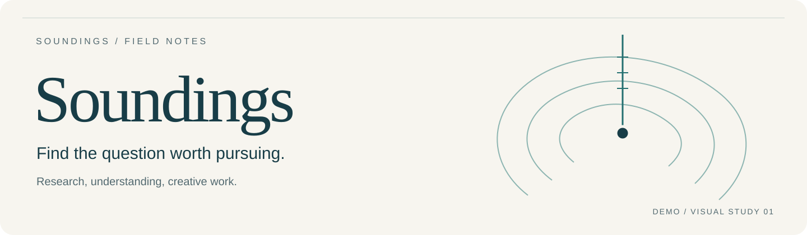

# Soundings visual study 01 / 视觉试作

[中文入口](../../README.zh-CN.md) · [English entry](../../README.md) · [Architecture](../architecture.md)

This is a proposed documentation identity for an early demo, not a final brand decision or a product release. It adds no runtime UI, tracking or network dependency. The existing path-level licence for `docs/**` applies; no new licensing terms are introduced.

这是一套文档用的视觉草案。意象来自测深线与开放的等深层线，不画成雷达监控、AI 火花、四阶段流水线或固定四象限。层线只是装饰，没有测量数据含义。

## Assets



[中文 banner](banner.zh-CN.svg) · [English banner](banner.svg) · [mark](logo.svg) · [inverse mark](logo-inverse.svg) · [monochrome mark](logo-mono.svg)

The mark is an original SVG drawing. The wordmark uses a local serif fallback; no font files, external images or generated raster assets are included. The inverse version is for dark surfaces. Keep at least one endpoint-circle diameter of clear space; use the standalone mark at 24 px or larger. Banners are 1440 × 420. Keep their aspect ratio; do not make a tiny banner carry the page's only explanation.

Logo 用探测线落在三条开放层线中。最小建议展示尺寸 24 px，外围至少留一个端点圆直径的空隙。反白版本用于深底。Banner 不是正文：名称、用途和 Demo 状态还必须以普通文字出现在页面里。

## Tokens and meaning

[`tokens.json`](tokens.json) records the palette, type, geometry, spacing and semantic roles; [`tokens.css`](tokens.css) provides reusable CSS names. [`mermaid-config.json`](mermaid-config.json) applies the same palette to diagrams. These are presentation tokens, not model, retrieval or product-state fields.

| Token | Value | Role |
| --- | --- | --- |
| paper | `#F7F5EF` | warm reading surface / 阅读底色 |
| ink | `#183D47` | main type and wordmark / 正文与标识 |
| muted | `#526970` | supporting text / 辅助说明 |
| teal / tealSoft | `#246F70` / `#E7F0ED` | Soundings methods / 方法 |
| blue / blueSoft | `#345C8B` / `#EAF0F7` | host and existing capabilities / 宿主已有能力 |
| ochre / ochreSoft | `#805A28` / `#F6EDD9` | optional local helpers / 可选工具 |

Colour does not mean success, quality or importance. Name the component and relationship in text. Use body text at 18 px, supporting labels at 14 px or more, and diagrams at intrinsic size when reading details. On narrow screens provide horizontal access or the adjacent text explanation; do not shrink a large architecture map until labels become decorative.

## Diagrams and regeneration

`01-responsibilities.mmd`, `02-evidence.mmd` and `03-installation.mmd` are the semantic diagram sources. The checked-in SVGs are static vector exports, with selectable text, title/description and no external references. The two architecture pages embed the same Mermaid source and provide prose equivalents. A diagram change must update the `.mmd`, its SVG and both code blocks together.

Install Mermaid CLI in a separate documentation environment, then run:

```sh
sh docs/visuals/render.sh
```

The script uses an already installed `mmdc`; it does not install dependencies. Use Mermaid 11.12.x-compatible rendering and review the output. This draft was parsed and rendered with locally available Mermaid **11.12.2** in Chromium. The environment's preloader was replaced with an in-memory module loader for offline rendering; no renderer or font binaries are included. GitHub's own Mermaid renderer may produce a different layout. Regeneration produces native SVG; the delivered exports have redundant Mermaid attributes/styles compacted without changing diagram content. Byte-for-byte layout stability is not promised across renderer or font versions.

## Review before adoption

Check the diagrams against their source anchors, all labels at a readable size, small-logo legibility, light/dark placement, mobile access and source/SVG parity. The architecture stays current only if component ownership and relations stay current. A polished banner cannot establish stable activation, research benefit or owner acceptance.
