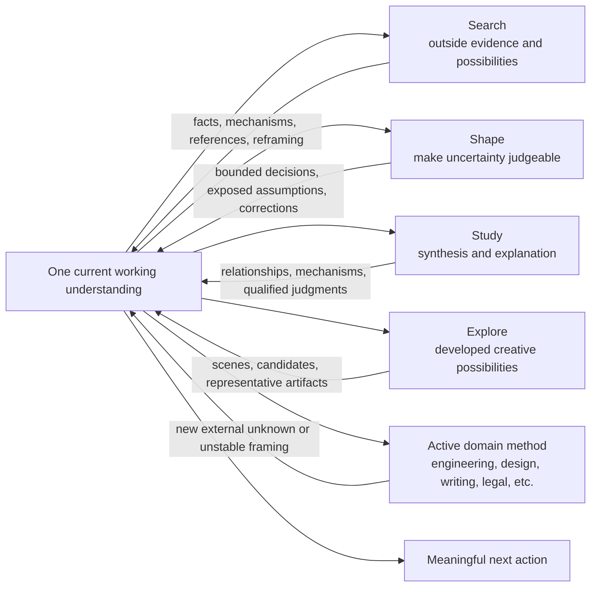

# Soundings design

## Purpose

Soundings develops evidence, understanding, possibilities, and judgeable choices without losing momentum, authorship, or creative range. It can complete an inquiry commission or contribute a bounded intervention inside a larger task. Understanding and creative development are valid outcomes in themselves.

Version 0.2 separates the completion of an inquiry action from the completion of the commission. A query may end before synthesis is done; a choice may be settled while its authorized correction still needs to reach the artifacts. The requested outcome determines delivery.

The design responds to two opposite failures:

- **Over-expansion:** every task becomes research, interviews, reports, artifacts, or approval gates.
- **Over-convergence:** the first workable interpretation hardens into architecture, specifications, and production before the important assumption becomes perceptible.

## Architecture

There is no Soundings orchestrator. The host discovers the relevant capability from its description. The capabilities may recur inside one task; none resets prior choices, requires the others, or creates a competing brief.

## Why four independent Skills

The discovery boundary is observable:

- `search` is justified by information or possibilities outside the current working context.
- `study` is justified by the need to explain relationships across a body of material. It can start with all the sources already supplied.
- `explore` is justified by a request to develop better possibilities. The goal can already be clear, and the result must be more than a list of features or references.
- `shape` is justified by uncertainty in what the current work should mean or make judgeable.

Methods can overlap while the primary commission stays clear. Search can synthesize what it finds; Study can verify a missing fact; Explore can produce a prototype; Shape can develop a counterform. A change of method does not require a formal transfer. Entry points identify recognizable requests, not exclusive internal operations or a sequence of stages.

Study and Explore make two previously underrepresented commissions directly discoverable: understanding a supplied body of material, and developing a clear creative goal. Their inclusion is a product choice supported by these distinct tasks; bounded behavior observations do not establish that four is an optimal number for all hosts.

## Boundaries with existing methods

- Repository engineering methods keep responsibility for implementation, debugging, risk, verification, and integration. Ordinary local inspection and reuse checks remain part of engineering work.
- Frontend and product-craft methods keep responsibility for content, interaction, rendering, accessibility, integration, and revision. Shape may reopen a mistaken product interpretation; it does not reduce design work to implementing a brief.
- Domain-specific research and decision skills retain their subject-matter contracts. Search can supply broader discovery, but it does not override legal, security, medical, academic, or other specialized evidence standards.
- Delegation is an execution choice, not a Soundings stage. The coordinator must give a worker the privacy-safe context that changes its judgment and remain responsible for synthesis.

## The shared state model

Soundings distinguishes five kinds of state:

1. desired outcome and qualities;
2. settled choices;
3. agent proposals or provisional mechanisms;
4. evidence and open unknowns;
5. current authority and next action.

The distinction prevents three common category errors: a polished specification turning an agent interpretation into a user decision; a successful experiment turning into product commitment; and a bounded preference turning into whole-project approval.

This state usually remains in conversation. Durable records are warranted only when the project already requires cross-session continuity or a decision authority.

## Action and permission

Skill selection never grants authority. Search may run a probe only when the current request permits it. Shape may continue an already authorized reversible implementation without creating a new approval gate. Read-only requests remain read-only, and external account, production, purchase, publication, private-data, and destructive actions retain their own boundaries.

## Optional evidence support

Native search and existing providers remain the acquisition paths. The optional Python helper in `skills/search/scripts/evidence.py` adds explicit local capture, exact snapshot/range rereading, literal finding, and a byte cap on complete JSON stdout. It has no external dependencies or network calls and can be invoked from other harnesses.

This is a narrow composition decision: the project does not need to own provider adapters or another research runtime to preserve already acquired text. A stored snapshot keeps selected short lines instead of filtering them by length. Whole requested ranges are included or visibly omitted. These properties address observed selection and budget failure paths; they do not prove general semantic completeness or superior search quality.

The contract distinguishes source representation from generated interpretation, local capture time from source freshness, and a stable local reference from a public citation. `complete` describes the requested range output, not research completeness. Soundings' reading method supplies the judgment about when to expand; the CLI cannot infer all distant qualifications or cause the agent to inspect them automatically.

Research effort, response size, and retention remain separate. Capture is an explicit authorized local write, not a side effect of searching. A new capture creates a new reference; old reads do not refresh silently. Optional remote corpus experiments, including Cloudflare, remain separate proposals with their own account, retention, and deployment decisions.

## Current boundaries

Version `0.2.0` has no:

- a global Soundings router;
- fixed stages or mandatory artifacts;
- automatic memory or personalization;
- a custom web-search service or MCP server;
- a fixed researcher worker;
- required edits to other installed Skills or harness configuration;
- automatic retention, source uploading, model-generated compression, or semantic index.

See the [current evidence summary](../../../docs/dogfood-0.2.0.md) for source, behavior, installation, and publication observations, and the [0.1.0 evidence](../../../docs/dogfood-0.1.0.md) for the earlier bounded tests. These are different claims; installation success does not establish useful inquiry, and a successful example does not prove broad effectiveness.
