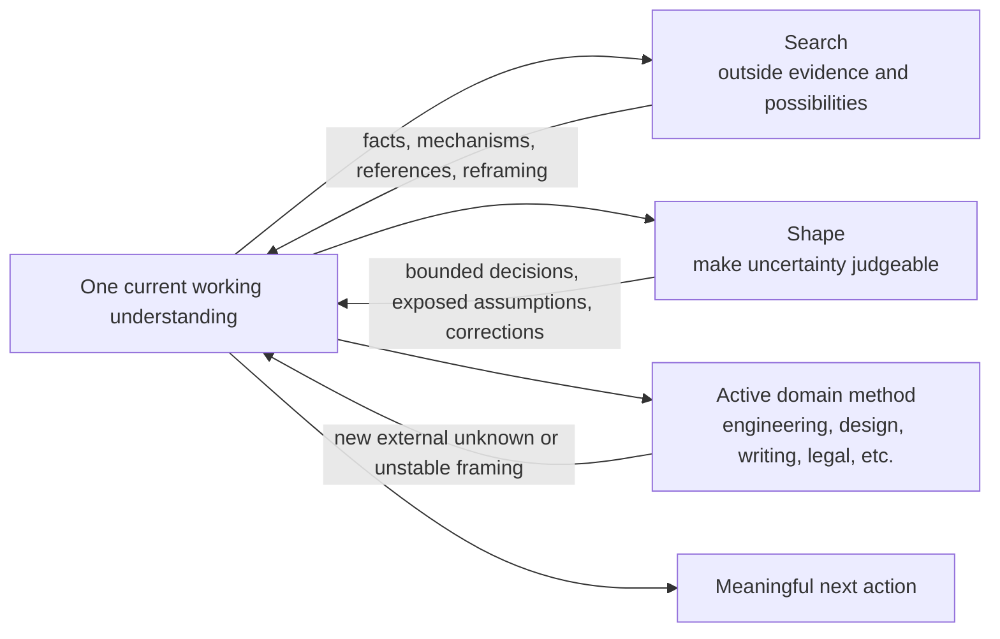

# Soundings design

## Purpose

Soundings chooses the next useful way to reduce uncertainty or expand possibility. The unit of work is not “finish research” or “complete requirements”; it is making the active project better understood without losing momentum, authorship, or creative range.

The design responds to two opposite failures:

- **Over-expansion:** every task becomes research, interviews, reports, artifacts, or approval gates.
- **Over-convergence:** the first workable interpretation hardens into architecture, specifications, and production before the important assumption becomes perceptible.

## Architecture

There is no Soundings orchestrator. The host discovers `search` or `shape` from their descriptions. Both can recur inside a task, but neither resets prior choices or creates a new brief.

## Why two Skills

The discovery boundary is observable:

- `search` is justified by information or possibilities outside the current working context.
- `shape` is justified by uncertainty in what the current work should mean or make judgeable.

They overlap at the handoff, not at the trigger. Search may uncover a product-level branch that Shape should clarify; Shape may identify a factual premise Search should verify. Combining them into one catch-all would make ordinary work more likely to trigger the entire method, while adding a router would recreate the orchestration layer the project is intended to avoid.

## Boundaries with existing methods

- Repository engineering methods keep responsibility for implementation, debugging, risk, verification, and integration. Ordinary local inspection and reuse checks remain part of engineering work.
- Frontend and product-craft methods keep responsibility for content, interaction, rendering, accessibility, integration, and revision. Shape may reopen a mistaken product interpretation; it does not reduce design work to implementing a brief.
- Domain-specific research and decision skills retain their subject-matter contracts. Search can supply broader discovery, but it does not override legal, security, medical, academic, or other specialized evidence standards.
- Delegation is an execution choice, not a Soundings stage. The coordinator must give a worker the privacy-safe context that changes its judgment and remain responsible for synthesis.

## The shared state model

Soundings distinguishes five kinds of state:

1. desired outcome and qualities;
2. settled choices;
3. agent proposals or provisional mechanisms;
4. evidence and open unknowns;
5. current authority and next action.

The distinction prevents three common category errors: a polished specification turning an agent interpretation into a user decision; a successful experiment turning into product commitment; and a bounded preference turning into whole-project approval.

This state usually remains in conversation. Durable records are warranted only when the project already requires cross-session continuity or a decision authority.

## Action and permission

Skill selection never grants authority. Search may run a probe only when the current request permits it. Shape may continue an already authorized reversible implementation without creating a new approval gate. Read-only requests remain read-only, and external account, production, purchase, publication, private-data, and destructive actions retain their own boundaries.

## First-version exclusions

Version `0.1.0` intentionally excludes:

- a global Soundings router;
- fixed stages or mandatory artifacts;
- automatic memory or personalization;
- a custom web-search service or MCP server;
- a fixed researcher worker;
- integration edits to other Skills before standalone behavior is observed;
- claims that installation, activation, or useful automatic invocation have been demonstrated.
