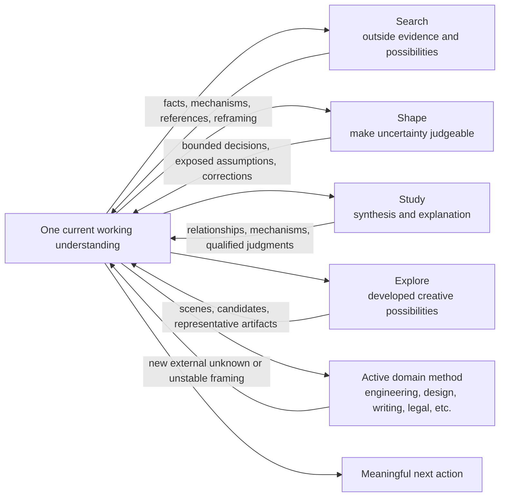
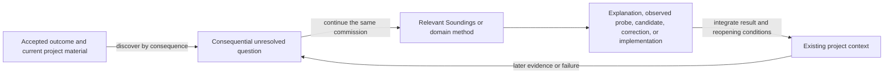
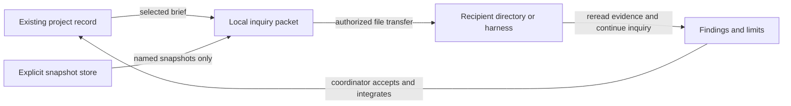

# Soundings design

## Purpose

Soundings develops evidence, understanding, possibilities, and judgeable choices without losing momentum, authorship, or creative range. It can complete an inquiry commission or contribute a bounded intervention inside a larger task. Understanding and creative development are valid outcomes in themselves.

Version 0.2 separated the completion of an inquiry action from the completion of the commission. Version 0.3.1 makes project-grounded inquiry explicit: Soundings can discover a consequential unresolved question in existing work and pursue it to a result the project can use. It also corrects the initial 0.3.0 framing by keeping portable research handoffs at optional maintenance scope and removing a rejected generic motion artifact from the forward product contract. A query may end before synthesis is done; a choice may be settled while its authorized correction still needs to reach the artifacts. The requested outcome determines delivery.

The `0.4.0` candidate addresses two connected gaps: discovery can be skipped before an open choice because the agent already knows a plausible implementation, and returned research can stop at a summary without changing the initiating work. Its source contract makes the open choice itself a reason for discovery and makes the receiver responsible for a local judgment, a concrete effect, and a return to the original scene. These are intended behaviors; [current state](../../../docs/current-state.md) separates their implementation from observed effect.

The design responds to two opposite failures:

- **Over-expansion:** every task becomes research, interviews, reports, artifacts, or approval gates.
- **Over-convergence:** the first workable interpretation hardens into architecture, specifications, and production before the important assumption becomes perceptible.

## Architecture

The bilingual [public website](../../../site/README.md) presents these responsibilities through a garden and constructed interactive examples. Its [visual contract](../../../docs/website-design.md) and static hosting live outside the plugin package. Website controls do not run Skills, and website publication does not change runtime behavior or its acceptance evidence.

```mermaid
flowchart LR
    W[One current working understanding]
    S[Search<br/>outside evidence and possibilities]
    T[Study<br/>synthesis and explanation]
    X[Explore<br/>developed creative possibilities]
    H[Shape<br/>make uncertainty judgeable]
    D[Active domain method<br/>engineering, design, writing, legal, etc.]
    E[Meaningful next action]

    W --> S
    W --> H
    W --> T
    W --> X
    W --> D
    S -->|facts, mechanisms, references, reframing| W
    H -->|bounded decisions, exposed assumptions, corrections| W
    T -->|relationships, mechanisms, qualified judgments| W
    X -->|scenes, candidates, representative artifacts| W
    D -->|new external unknown or unstable framing| W
    W --> E
```

There is no Soundings orchestrator. The host discovers the relevant capability from its description. The capabilities may recur inside one task; none resets prior choices, requires the others, or creates a competing brief.

The [host integration guide](host-integration.md) describes how an existing engineering method or custom harness can make the open-choice condition visible before selection, keep method resources readable, and return results to the commission owner. It does not configure that host. Soundings owns method content; a host owns delivery, execution continuity, and permission enforcement; actual outcomes still require observation.

## Why four independent Skills

The discovery boundary is observable:

- `search` is justified by information or possibilities outside the current working context.
- `study` is justified by the need to explain relationships across a body of material. It can start with all the sources already supplied.
- `explore` is justified by a request to develop better possibilities. The goal can already be clear, and the result must be more than a list of features or references.
- `shape` is justified by uncertainty in what the current work should mean or make judgeable.

Methods can overlap while the primary commission stays clear. Search can synthesize what it finds; Study can verify a missing fact; Explore can produce a prototype; Shape can develop a counterform. A change of method does not require a formal transfer. Entry points identify recognizable requests, not exclusive internal operations or a sequence of stages.

Study and Explore make two previously underrepresented commissions directly discoverable: understanding a supplied body of material, and developing a clear creative goal. Their inclusion is a product choice supported by these distinct tasks; bounded behavior observations do not establish that four is an optimal number for all hosts.

These entrypoints do not impose a permanent size or instruction-only ceiling. A new capability should make a concrete commission possible, deeper, or easier to continue. Existing tools need not fail completely before growth is justified. Source discovery, corpus lookup, original-source reading, sustained research execution, and inspection of visual/interactive works have different contracts; the [source-capability reference](../skills/search/references/source-capabilities.md) explains their composition without creating a provider registry or required pipeline.

## Project-grounded inquiry

When a person asks what in an existing project is worth pursuing, Study can own the complete commission even though the narrower question has not yet been supplied. It recovers the project's accepted outcome, current artifacts, settled choices, and live proposals; identifies the unresolved relationship or failure with the greatest consequence; and pursues it through the method that can produce a usable result.

```mermaid
flowchart LR
    P[Accepted outcome and current project material]
    Q[Consequential unresolved question]
    M[Relevant Soundings or domain method]
    R[Explanation, observed probe, candidate, correction, or implementation]
    C[Existing project context]

    P -->|discover by consequence| Q
    Q -->|continue the same commission| M
    M --> R
    R -->|integrate result and reopening conditions| C
    C -->|later evidence or failure| Q
```

The diagram is a feedback loop, not a required sequence of Skills. The question may be answered by Study itself or require Search, Explore, Shape, engineering, design, or another active method. Discovery is incomplete if the agent returns only a repository summary, feature backlog, plan, or proposal for work it can perform within the current authority. A technically successful side artifact is not representative product progress unless it answers the project-grounded question or advances the accepted outcome.

## Boundaries with existing methods

- Repository engineering methods keep responsibility for implementation, debugging, risk, verification, and integration. Ordinary local inspection and reuse checks remain part of engineering work.
- Frontend and product-craft methods keep responsibility for content, interaction, rendering, accessibility, integration, and revision. Shape may reopen a mistaken product interpretation; it does not reduce design work to implementing a brief.
- Domain-specific research and decision skills retain their subject-matter contracts. Search can supply broader discovery, but it does not override legal, security, medical, academic, or other specialized evidence standards.
- Delegation is an execution choice, not a Soundings stage. The coordinator must give a worker the privacy-safe context that changes its judgment and remain responsible for synthesis.

## Discovery and return inside one commission

The unit of discovery is a substantial open choice, not a project's age or code volume. Existing implementation, accepted behavior, open dimensions, and reference coverage are distinct. An empty repo may already have an accepted form; a mature system may contain an entirely new interaction domain. A settled small repair remains direct.

Source depth follows its intended contribution. Discovery may begin with a description; experience judgments need the relevant medium; mechanism claims need the decisive implementation path; adoption needs local compatibility and operating conditions. Named targets receive proportionate coverage, while discovered candidates can be triaged. Cross-source understanding compares shared questions and distinguishes alternatives, complementary contributions, and incompatible premises.

The receiver relates returned evidence to the original desired outcome, the explanation being tried, and the narrower inquiry question. It forms a local judgment rather than inheriting a source's recommendation. That judgment identifies the actual object or behavior to change, preserves the learned relationship through production, and updates dependent plans and acceptance when a premise changes. A return to the initiating scene distinguishes a useful effect from a technically correct but irrelevant patch.

Repeated rejection warrants inspecting the actual failed work and identifying what the next candidate can distinguish: intent, interaction relationship, execution quality, or inadequate fidelity. Repeated search or replanning without new evidence or progress does not advance the commission. Positive discovery can also open a worthwhile direction without a prior defect. Understanding-only work may finish with a sufficient explanation; implementation work continues within its granted scope.

Worked examples live in the runtime reference paths that use them. They show a complete constructed development, including an attractive route not adopted and a nearby direct-action case. They are teaching material, not live research evidence, fixed output formats, or a requirement to reproduce their domain.

## The shared state model

Soundings distinguishes the following parts of its working understanding:

1. desired outcome and qualities;
2. settled choices;
3. agent proposals or provisional mechanisms;
4. evidence and open unknowns;
5. the live inquiry question, where one exists;
6. current authority and next action.

The distinction prevents three common category errors: a polished specification turning an agent interpretation into a user decision; a successful experiment turning into product commitment; and a bounded preference turning into whole-project approval.

This state usually remains in conversation. Durable records are warranted only when the project already requires cross-session continuity or a decision authority.

## Action and permission

Skill selection never grants authority. Search may run a probe only when the current request permits it. Shape may continue an already authorized reversible implementation without creating a new approval gate. Read-only requests remain read-only, and external account, production, purchase, publication, private-data, and destructive actions retain their own boundaries.

## Optional evidence maintenance

Native search and existing providers remain the acquisition paths. The optional Python helper in `skills/search/scripts/evidence.py` adds explicit local capture, exact snapshot/range rereading, literal finding, and a byte cap on complete JSON stdout. It has no external dependencies or network calls and can be invoked from other harnesses.

This is a narrow composition decision: the project does not need to own provider adapters or another research runtime to preserve already acquired text. A stored snapshot keeps selected short lines instead of filtering them by length. Whole requested ranges are included or visibly omitted. These properties address observed selection and budget failure paths; they do not prove general semantic completeness or superior search quality.

The contract distinguishes source representation from generated interpretation, local capture time from source freshness, and a stable local reference from a public citation. `complete` describes the requested range output, not research completeness. Soundings' reading method supplies the judgment about when to expand; the CLI cannot infer all distant qualifications or cause the agent to inspect them automatically.

Scoped `find` admits literal windows only within the selected line range and supplies an explicit continuation after the first omitted window has been handled. Capture stages complete JSON and uses a no-clobber hard link before exposing a snapshot name; it requires filesystem hard-link support and does not promise power-loss durability.

## Optional portable research handoffs

The previous helper could be used by another harness only with access to the selected store. The optional `skills/search/scripts/packet.py` now makes that selection portable: an explicit brief, a manifest, and copies of named evidence snapshots. It reuses the existing evidence schema and loader. The recipient reads the copied store with the same evidence CLI; no import or original file path is required.

```mermaid
flowchart LR
    R[Existing project record] -->|selected brief| P[Local inquiry packet]
    S[Explicit snapshot store] -->|named snapshots only| P
    P -->|authorized file transfer| T[Recipient directory or harness]
    T -->|reread evidence and continue inquiry| J[Findings and limits]
    J -->|coordinator accepts and integrates| R
```

This diagram describes implemented local selection/readback and the caller-owned handoff. The tool performs no transfer, delegation, or acceptance itself. Packet creation writes a manifest last, refuses an existing output, and reports failure rather than a successful partial packet. Inspection checks membership and readability, not authenticity, confidentiality, evidence quality, or task permission. An interrupted packet stays local for diagnosis; no automatic cleanup or upload occurs.

The brief preserves why the question matters, settled choices versus proposals, evidence dependencies, competing explanations, read coverage, and the remaining responsibility. Use the project's existing record for accepted findings, useful unused clues, and reopening conditions. The packet is a selected copy for continuation, never a second canonical project record. A generated synthesis can travel alongside source text with its representation intact; it is not independent corroboration of its own sources.

Source locators and content are copied as supplied and may contain sensitive material. Transfer authorization and content inspection remain with the caller. Media files and sources merely linked from the brief are not automatically bundled. A research assistant may inspect an experiment's competing histories while a system under test must receive only its authorized test input; portability does not erase that boundary.

Research effort, response size, and retention remain separate. Capture is an explicit authorized local write, not a side effect of searching. A new capture creates a new reference; old reads do not refresh silently. Optional remote corpus experiments, including Cloudflare, remain separate proposals with their own account, retention, and deployment decisions.

## Current boundaries

The `0.4.0` candidate has no:

- a global Soundings router;
- fixed stages or mandatory artifacts;
- automatic memory or personalization;
- a custom web-search service or MCP server;
- a fixed researcher worker;
- required edits to other installed Skills or harness configuration;
- automatic retention, source uploading, model-generated compression, or semantic index.

See [current state](../../../docs/current-state.md) for candidate status and the [0.3.1 evidence summary](../../../docs/dogfood-0.3.1.md) for earlier behavior and installation observations; [0.3.0](../../../docs/dogfood-0.3.0.md) preserves the corrected release history, and the [0.2.0](../../../docs/dogfood-0.2.0.md) and [0.1.0](../../../docs/dogfood-0.1.0.md) records preserve earlier observations. These are different claims; installation success does not establish useful inquiry, and a successful example does not prove broad effectiveness.
